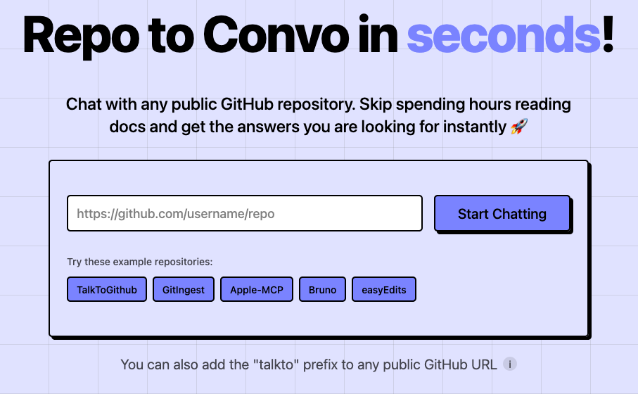

<h1 align="center">TalkToGitHub</h1>

[](https://talktogithub.com)

[](https://discord.com/invite/JKtHeSn4S7)

Chat with any GitHub repository within seconds.

You can also add the `talkto` prefix to any GitHub repository URL.

<h2>Watch TTG in Action</h2>
<video width='600' controls>
  <source src='./frontend/public/TTG-demo-final.mp4' type='video/mp4'>
  Your browser does not support the video tag.
</video>

## Roadmap
- [ ] Repo and query caching
- [ ] Support individual files and folders
- [ ] Support for local files
- [ ] Support for larger repositories (>1M tokens)
- [ ] Streaming responses
- [ ] Save queries to user account
- [ ] BYOK support

## How to run locally

Prerequisites:
- [Python 3.13+](https://www.python.org/downloads/release/python-3130/)
- [uv](https://docs.astral.sh/uv/)
- [node 23.6.0+](https://nodejs.org/en/download)

1. Clone the forked repository:

  ```bash
  git clone https://github.com/HarishChandran3304/TTG.git
  cd TTG
  ```

2. Set up the backend:

  ```bash
  uv venv
  source venv/bin/activate
  uv sync
  ```

3. Add the following to your `.env` file:
  ```bash
  GEMINI_API_KEY=<your-gemini-api-key>
  GEMINI_MODEL=gemini-2.0-flash
  ENV=development
  FALLBACK_COUNT=0
  ```

4. Run the server:
  ```bash
  fastapi dev src/main.py
  ```

5. This should start the server at localhost:8000.

6. Set up the frontend:
  ```bash
  cd frontend
  npm install
  npm run dev
  ```

7. This should start the frontend at localhost:5173.

## Contributing
Check out the [contributing guide](./CONTRIBUTING.md) to learn how to contribute to TalkToGitHub.

## Tech Stack
### Frontend
- [Vite](https://vitejs.dev/)
- [React](https://reactjs.org/)
- [TailwindCSS](https://tailwindcss.com/)
- [Shadcn UI](https://ui.shadcn.com/)

### Backend
- [Python](https://www.python.org/)
- [FastAPI](https://fastapi.tiangolo.com/)
- [Gemini](https://gemini.google.com/)

## Support

If you need help, please join our [Discord](https://discord.com/invite/JKtHeSn4S7) server. We will be happy to help!

To request a feature or report an issue, please [create an issue](https://github.com/HarishChandran3304/TTG/issues/new) on GitHub.

[](https://x.com/harishchan3304)